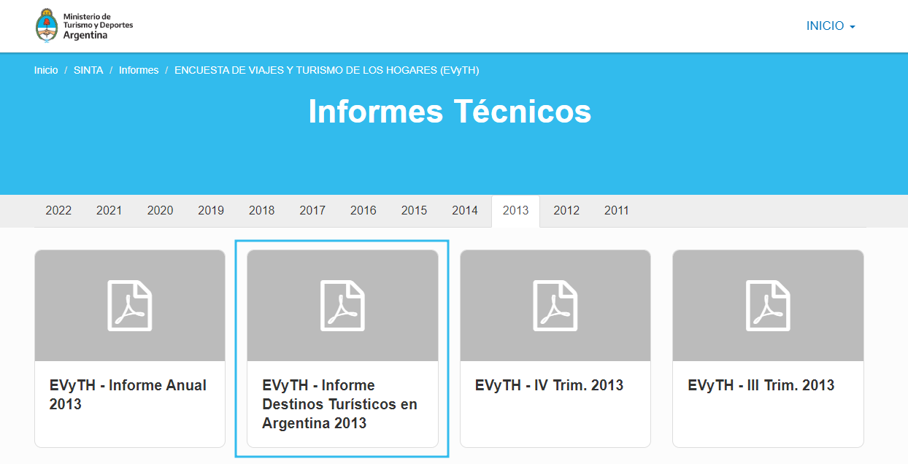
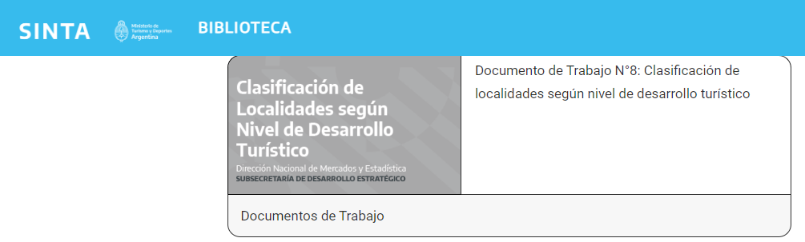
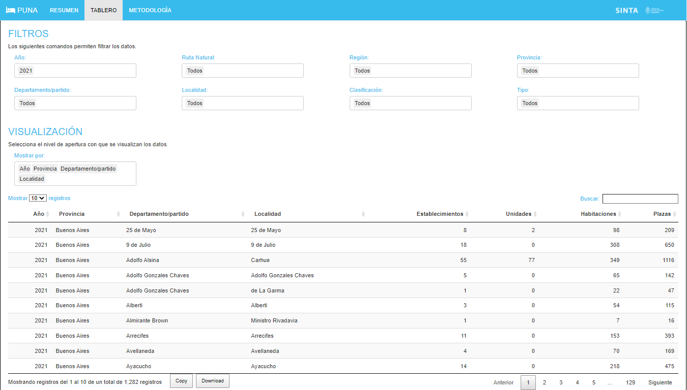
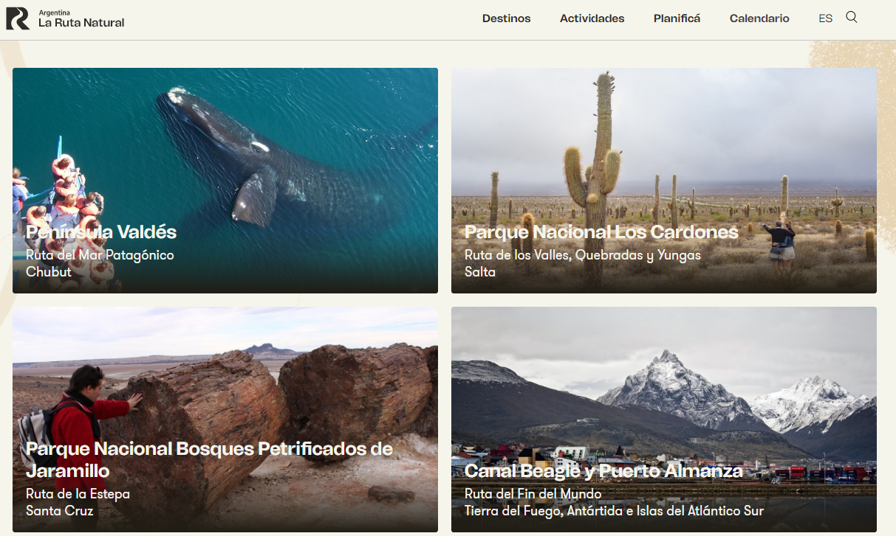
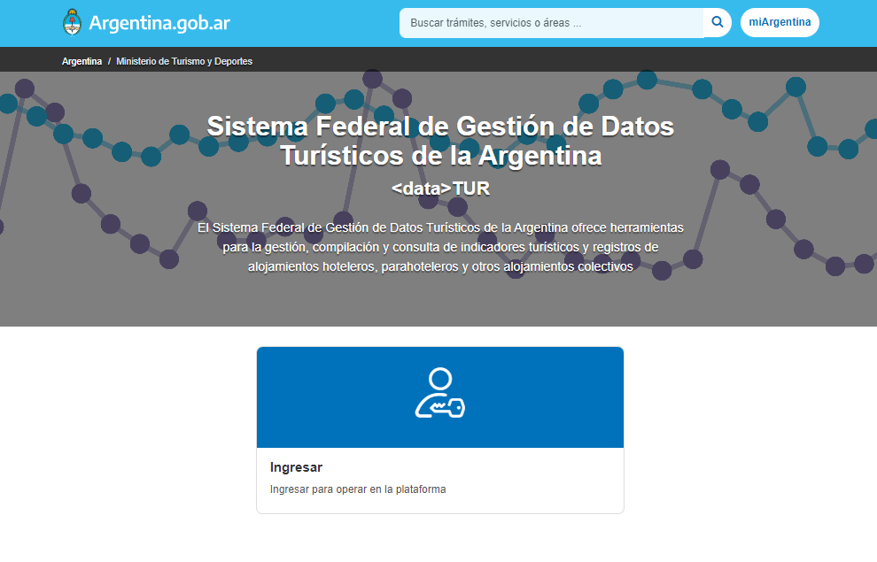

class:inverse, middle

background-image: url(https://tableros.yvera.tur.ar/recursos/logos_institucionales/escudo_mdtyd_blanco.png)
background-position: 95% 95%
background-size: 30%

### Dirección Nacional de Mercados y Estadística<br>Subsecretaría de Desarrollo Estratégico

### Foro Nacional de Turismo 2023

#### Ushuaia, 23 de mayo de 2023

<br>
<br>
<br>
<br>
<br>
<br>
<br>
<br>
<br>
<br>


```{r, echo=FALSE, warning=FALSE}
library(xaringanExtra) # Extras and Extensions for 'xaringan' Slides, CRAN v0.7.0
# LOGO COLOR EN PAGs INTERNAS
xaringanExtra::use_logo(image_url = "https://tableros.yvera.tur.ar/recursos/logos_institucionales/escudo_mdtyd_color.png", 
                        position = css_position(top = "1em", right = "1em"), 
                        height = "20%", width = "20%")
# BARRA DE PROGRESO DE PRESENTACION
xaringanExtra::use_progress_bar(color = comunicacion::dnmye_colores("cian"))
# LAPIZ 
xaringanExtra::use_scribble()
# EXPLORADOR DE SLIDES
xaringanExtra::use_tile_view()
# HABILITAR WEBCAM
xaringanExtra::use_webcam()
```


```{r dnmye_theme, include=FALSE, warning=FALSE, eval=TRUE}
library(xaringanthemer) #EVAL FALSE
library(comunicacion)
library(herramientas)
library(tidyverse)
library(sf)
library(leaflet)
library(geoAr)

style_mono_light(outfile = "dnmye_theme.css", # CSS FILE
                 # FONTS
                  header_font_google = google_font('Encode Sans'),
                  text_font_google   = google_font('Roboto'),
                  code_font_google   = google_font('IBM Plex Mono'),
                 # COLORES 
                 base_color = dnmye_colores("cian"),
                 code_inline_color = dnmye_colores("rosa"), 
                 inverse_link_color = "#3B4449",
                 background_color = "#FFFFFF",
                 title_slide_background_image = "escudo_mintur_blanco.png", 
                 title_slide_background_position = "95% 5%", 
                 title_slide_background_size = "200px", footnote_color = "#3B4449", link_color = "3B4449",text_slide_number_font_size = "16px"
                  
                 )
```


```{r setup, include=FALSE, eval = TRUE}
options(htmltools.dir.version = FALSE)
knitr::opts_chunk$set(
  fig.width=9, fig.height=3.5, fig.retina=3,
  out.width = "100%",
  cache = FALSE,
  echo = TRUE,
  message = FALSE, 
  warning = FALSE,
  fig.show = TRUE,
  hiline = TRUE
)
```


```{css, echo=FALSE}
div.my-footer {
    background-color: white;
    position: absolute;
    bottom: 0px;
    left: 0px;
    height: 40px;
    width: 100%;
}
div.my-footer span {
    font-size: 16px;
    color: #3B4449;
    position: absolute;
    left: 15px;
    bottom: 6px;
}


```


---
layout: true

<div class="my-footer"><span>DIRECCIÓN NACIONAL DE MERCADOS Y ESTADÍSTICA <a href="https://yvera.tur.ar/sinta"> - <b>www.yvera.tur.ar/sinta</a></b></span></div> 


---


class: middle


background-position: 80% 50%
background-size: 25%

### Juan Gabriel Juara

Coordinador del equipo de Datos

####  Dirección Nacional de Mercados y Estadística 

#### Ministerio de Turismo y Deportes de la Nación

Sociólogo -  Universidad de Buenos Aires

jgjuara@turismo.gob.ar

---


background-image: url(https://raw.githubusercontent.com/dnme-minturdep/blog/master/_posts/2022-09-08-sintia/sintIA.png)
background-position: 80% 70%
background-size: 35%


<br>

.pull-left[.center[
## `r emojifont::emoji("robot")` SintIA
##El bot del Sistema de Información Turística de la Argentina (SINTA)
]]


---
class: middle, inverse

## Medición del desarrollo turístico

### Hacia un indicador multidimensional para las localidades del país

---
<br>
<br>
<br>

### ¿Para qué medir el desarrollo turístico?

--

#### - Identificación temprana de oportunidades para el desarrollo

--

#### - Planificación basada en evidencia

--

#### - Transparencia en la toma de decisiones

--

#### **Continuidad en el tiempo de los criterios de gestión**

---
<br>
<br>

### ¿Por qué un indicador multidimensional para  localidades?

#### `r emojifont::emoji("black_circle")` Vacancia de indicadores nacionales a bajos niveles de desagregación geográfica

--


#### `r emojifont::emoji("black_circle")` Realidades locales diversas

--

#### `r emojifont::emoji("black_circle")` Múltiples fuentes de datos

--

#### **Necesidad de una armonización nacional en un único instrumento**

---
<br>
<br>

### SINTA - *Sistema de Información Turística de la Argentina*

--

#### Operativos estadísticos: `EOH, ETI, EVyTH`

--

#### Registros Administrativos (`PUNA, AFIP, ANAC, CNRT`, etc.)

--

#### Reportes de estimaciones jurisdiccionales **Sistema Federal de Gestión de Datos  Turísticos `<data>TUR` (trabajo en progreso)**


---
<br>

### Aproximaciones al desafío

--

#### 1. Informe sobre Destinos Turísticos en Argentina 

#### 2. Clasificación de localidades según nivel de desarrollo

#### 3. Hacia donde vamos: Indicador multidimensional

---

<br>
### Informe sobre Destinos Turísticos en Argentina 

#### Año 2013

--

.pull-left[
- **Fuente:** EVyTH

- **Fortalezas:**

    - Datos de perfil del turismo: estadía promedio, gasto promedio, diferencia entre turistas y excursionistas, datos de alojamiento y medio de transporte usado, entre otros.
    
    - Estimaciones confiables a nivel nacional y regional trimestrales y provincial anual. 

- **Limitaciones:**

    - Dificultad para estimaciones en destinos a menor nivel de agregación debido a la naturaleza muestral del dato. 
    ]
    
.pull-right[
<br>
https://www.yvera.tur.ar/sinta/informe/
]


---
<br>

### Clasificación de localidades según nivel de desarrollo

#### Marzo 2023

--


.pull-left[

- **Fuente:** PUNA

- **Fortalezas:**
  - Cobertura geográfica a nivel localidad
  - Datos registrales: el error no es muestral

- **Limitaciones:**
    - Sólo contempla la oferta
    - Unidimensional
    - No mide oferta que no está formalmente registrada
    ]
    
.pull-right[
  
<br>
https://biblioteca.yvera.tur.ar/

]
    
---

.center[.middle[]]

---

### Clasificación de localidades según nivel de desarrollo

.center[]

---

```{r, out.height= '90%', echo = FALSE}

puna_geom <- read_file_srv("/srv/DataDNMYE/capas_sig/puna_localidades_bahra.gpkg")

puna_geom <- puna_geom %>% 
  mutate(clasificacion = case_when(
    plazas <= 600 ~ "Emergente",
    plazas > 600 & plazas <= 2000 ~ "En desarrollo",
    plazas > 2000 ~ "Consolidado", 
  )) %>% 
  mutate(clasificacion =  factor(clasificacion, levels = c("Emergente",
                                                           "En desarrollo",
                                                           "Consolidado"))
  )

bahra <- read_file_srv("/srv/DataDNMYE/capas_sig/bahra_base_total.geojson") %>% 
  filter(str_detect(nombre, "Tolhuin")) %>% 
  select(nombre, geometry) #%>% 
  
tolhuin <- bahra %>% 
  mutate(long = unlist(map(bahra$geometry,1)),
         lat = unlist(map(bahra$geometry,2))) %>% 
  st_drop_geometry()

tolhuin <- puna_geom %>% 
  st_drop_geometry() %>% 
  filter(localidad == "tolhuin") %>% 
  cbind(tolhuin %>% select(-1)) #%>% 
  # st_drop_geometry()

puna <- puna_geom %>% 
  st_cast("POINT") %>% 
  mutate(long = unlist(map(geom,1)),
         lat = unlist(map(geom,2))) %>% 
  st_drop_geometry() %>% 
  rbind(tolhuin) %>% 
  st_as_sf(coords = c("long", "lat"), crs = 4326)

#write_sf(puna, "salidas/puna_localidades_bahra2.geojson")

puna <- puna %>% 
  mutate(across(c(provincia, departamento_partido, localidad),  toupper))

labels <- paste0("Localidad: ", puna$localidad,
                 "<br>Departamento: ",  puna$departamento_partido,
                 "<br>Provincia: ",  puna$provincia,
                 "<br>Plazas: ",  puna$plazas,
                 "<br>Establecimientos: ",  puna$establecimientos,
                 "<br>Clasificación: ",  puna$clasificacion) %>%
    lapply(htmltools::HTML)

pal <- colorFactor(
  palette = c(comunicacion::dnmye_colores("purpura"),
              comunicacion::dnmye_colores("azul verde"),
              comunicacion::dnmye_colores("naranja")),
  domain = puna$clasificacion
)

leaflet() %>% 
  addArgTiles() %>% 
  addCircleMarkers(data = puna, color = ~ pal(clasificacion),
             label = labels, popup = labels) %>% 
  addLegend(pal = pal, values = puna$clasificacion, opacity = 1)

```


---

<br>


### Indicador multidimensional del desarrollo turístico

#### En construcción

--

¿Qué buscamos?

--

- Un indicador que contemple 3 dimensiones: 
    - Demanda 
    - Oferta 
    - Recursos turísticos identificados
    
- Que tenga granularidad a nivel localidad.

- Que permita frecuencia mínima anual.

- Que tenga una metodología de cálculo formalizable.

---
### Indicador multidimensional del desarrollo turístico
#### Demanda 

  - Pasajeros arribados en base CNRT
  - Pasajeros arribados en base a ANAC
  - Visitantes Áreas Protegidas

--

#### Oferta

  - Empresas Registradas Ramas Características del Turismo (RCT)
  - Establecimientos Registros RCT
  - PUNA
  - Registros de Agencias de Viajes
  
--

#### Potencialidad

  - Proximidad de `destinos imperdibles` de **La Ruta Natural**
  - Fiestas Nacionales, Provinciales, Locales
  - Puntos de Conexión Internacional
  - Conectividad Vial 
  
---

#### Imperdibles

.center[.middle[]]


---

#### Imperdibles

```{r, echo = FALSE, out.height= '65%'}

imperdibles <- read_file_srv('/DataDNMYE/capas_sig/imperdibles.gpkg')

imperdibles %>% 
  leaflet() %>% 
    addArgTiles() %>% 
      addCircles(data = puna %>% st_cast('POINT'), color = "#EE3D8F") %>% 
    addPolygons(label = ~ nombre_ppal)
```


---


### Indicador multidimensional del desarrollo turístico
#### PUNA

**¿Qué queda por agregar?**

#### El Sistema Federal de Gestión de Datos  Turísticos para  mejorar la frecuencia de actualización de los de datos

.center[]


---

### Indicador multidimensional del desarrollo turístico
#### EMPRESAS REGISTRADAS

```{r, echo = FALSE, out.height= '60%'}

puna_padron_afip <- read_file_srv('/srv/DataDNMYE/ppt_usuhaia/salidas/puna_prestadores.rds') 


puna_padron_afip %>% 
  st_cast(to = 'POINT') %>% 
  filter(!st_is_empty(geom)) %>% 
  filter(!is.na(Transporte) & !is.na(Gastronomía)) %>% 
  mutate(across(.cols = c(Transporte,Gastronomía, Alojamiento, `Otros Servicios Turísticos`), function(x) {replace_na(as.character(x), "sd.")})) %>% 
  mutate(etiq = glue::glue('{str_to_title(localidad)}<br>Gastronomía = {Gastronomía}<br>Transporte:{Transporte}')) %>% 
  leaflet() %>%
  addArgTiles() %>% 
  addCircleMarkers(label = ~ lapply(etiq, htmltools::HTML), popup =  ~ lapply(etiq, htmltools::HTML))

```


---
### Indicador multidimensional del desarrollo turístico
#### ANAC

```{r, echo=FALSE,  out.height= '60%'}

puna_aeropuertos <- read_file_srv('/srv/DataDNMYE/ppt_usuhaia/salidas/puna_aeropuertos.rds')


puna_aeropuertos <- puna_aeropuertos %>% 
  mutate(etiq = glue::glue(
    "{str_to_title(localidad)}
    <table>
  <tr>
    <th>Aeropuerto cercano</th>
    <th>{aero_mas_cerca}</th>
  </tr>
  <tr>
    <th>Tiempo</th>
    <th>{lbl_int(tiempo_aero_cerca)}min.</th>
  </tr>
  <tr>
    <th>Indice Cabotaje</th>
    <th>{lbl_int(indice_cabotaje_mas_cerca)}</th>
  </tr>
  <tr>
    <th>Indice Internacional</th>
    <th>{lbl_int(indice_int_mas_cerca)}</th>
  </tr>
</table>"
  ))

puna <- read_file_srv("/srv/DataDNMYE/capas_sig/puna_localidades_bahra.gpkg")


puna_aeropuertos <- left_join(puna, puna_aeropuertos)

puna_aeropuertos %>% 
  filter(!st_is_empty(geom)) %>% 
  mutate(geom = st_cast(geom, "POINT")) %>% 
  leaflet() %>% 
  addArgTiles() %>% 
  addCircleMarkers(color = comunicacion::dnmye_colores("rosa"), label = ~ lapply(etiq, htmltools::HTML) , popup = ~ lapply(etiq, htmltools::HTML))

```


---

class:  center, middle, inverse

# ¡Muchas gracias!

##[**`yvera.tur.ar/sinta`**](https://www.yvera.tur.ar/sinta/)

---

- 

